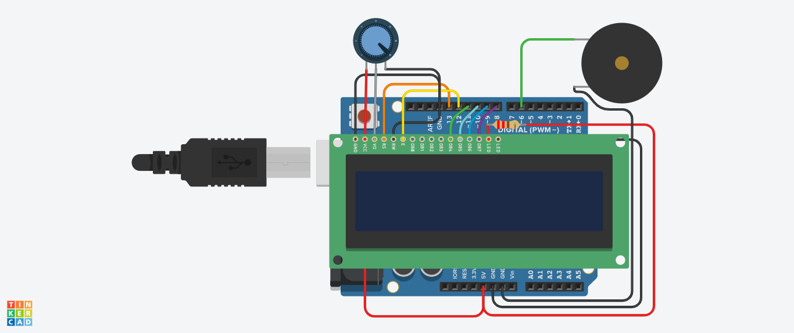

# Stopwatch using Arduino, LCD and a Buzzer

This project is for creating a Stopwatch having following functionality:-
1.  Take input from the serial monitor
2.  When time runout it must shows on display time runout
3.  And also it should produce beep sound.
4.  Then again ask for the input

<b>Project simulation link</b>
https://www.tinkercad.com/things/jHiDWI1K9DT-copy-of-q9/editel?sharecode=WLzn5hDUp5zpV3LtyWFlLItcSfykehVi4-bsTFU4ZR4

<b>Circuit Diagram</b>

